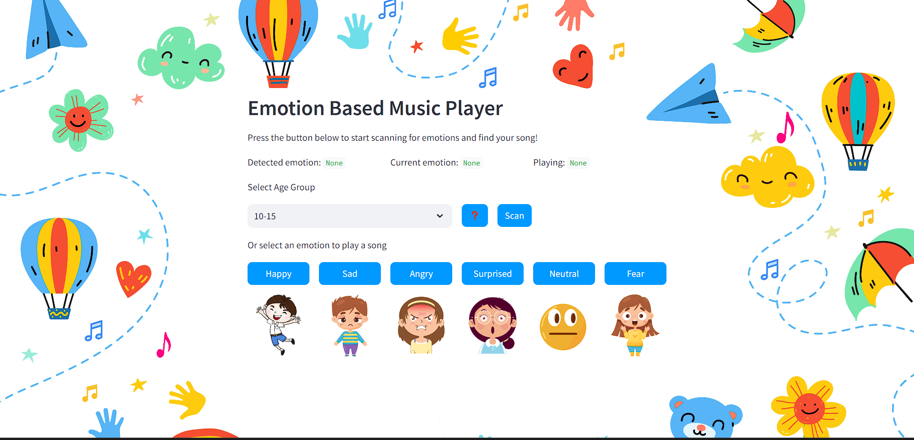

# StarLight: Music for Emotions - A CHAS Initiative



## Overview

StarLight is an interactive web application specially developed for Children's Hospices Across Scotland (CHAS) to enrich the lives of children and families by playing music that resonates with the user's current feelings. By combining intuitive user experience design and state-of-the-art sentiment analysis, StarLight aims to provide a personalized and therapeutic musical journey.

## Features

* **Emotion Recognition** : Our app recognizes how your feeling and determines your mood.
* **Dynamic Playlist** : A playlist is generated based on your mood, using a vast library of songs.
* **Offline Mode** : Access locally-stored playlists for seamless offline listening experiences.
* **User Profiles** : Save your preferred tracks and emotional playlists for quick retrieval and future enjoyment.
* **Accessibility** : Optimized for multiple devices and includes features like voice commands for easier navigation.

## Installation

Clone the repository:

```bash
git clone https://github.com/leo-lungu/Starlight-Hackathon.git
```

Navigate to the project directory:

```bash
cd Starlight-Hackathon
```

Install the required packages:

```bash
pip install -r requirements.txt
```

## Set Up YouTube API Key

**Create Environment File:** Create a .env file in the root directory of the project.

**Generate an API Key:** Follow these [instructions](https://developers.google.com/youtube/v3/getting-started) to create your own key

**Add API Key to .env:** Open .env and add your API key

```
YOUTUBE_API_KEY="YOUR_API_KEY"
```

## Usage

Run the Streamlit app:

```
streamlit run "PATH"/starlight/Starlight-Hackathon/app.py
```

Open your web browser and go to `http://localhost:8501/`.
